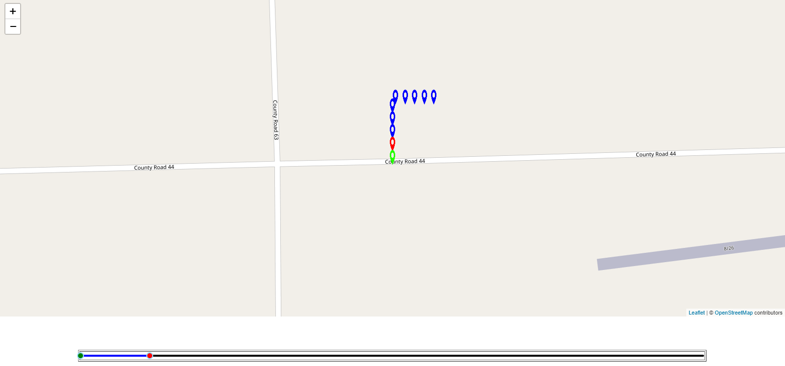
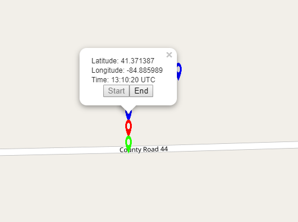
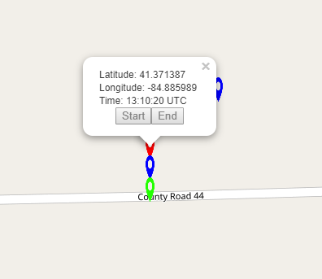

This project was bootstrapped with [Create React App](https://github.com/facebookincubator/create-react-app).

## Table of Contents

- [Introduction](#introduction)
- [Prerequisites](#rerequisites)
- [How to Use](#how-to-use)

## Introduction

PointPicker is an application that utilizes the `React.js` and `Leaflet.js` libraries. Using a file with an array of several coordinates, PointPicker allows the user to select a start and end point from the list and displays them on a map.

## Prerequisites

A `points.js` file is needed to map all the points. The file consists of only an array of coordinates with the following attributes: latitude, longitude, and time. An example of a points file is displayed below:

### `points.js`

```js
module.exports = [
  {"latitude": 41.3709670, "longitude": -84.8859890, "time": "13:09:38 UTC"},
  {"latitude": 41.3711770, "longitude": -84.8859890, "time": "13:09:59 UTC"},
  {"latitude": 41.3713870, "longitude": -84.8859890, "time": "13:10:20 UTC"},
  {"latitude": 41.3715970, "longitude": -84.8859890, "time": "13:10:41 UTC"},
]
```

The `points.js` file should be placed into the `.src/` folder in order to be read.

## How to Use

### Initial Start

The screen capture below shows the app when it is first started up:



### Selecting Start/End Points

Start/End points can be selected by two different methods. The first is just selecting the points individually by clicking on them. The more fluent method is using the given slider to quickly find points, especially if there are a bunch of them.

#### Clicking A Marker

Upon clicking on any marker, a popup will appear with all the properties of that selected point. The latitude, longitude, and time are displayed in the popup. Below the properties, there are two buttons, `Start` and `End`.



As you notice from the example image above, you can see that the `Start` button is disabled. This is because the point selected is after the selected "End" point. The same goes for the `End` button, which is disabled on any point before the selected "Start" point. Any markers in between the "Start" and "End" points can be made either a start/end point.

The image below shows what occurs after an "End" point is selected using this method.



You can see that the selected point now turns red and the previous "End" point turns blue. This is how you can select start/end points by clicking on an individual marker.

#### Using the Slider
